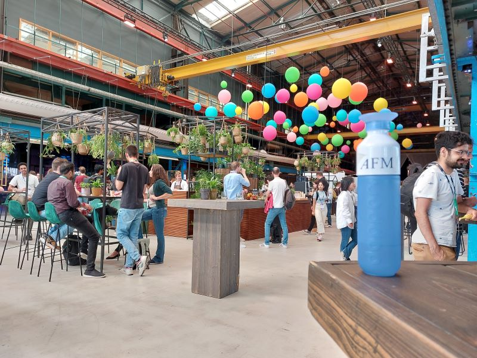
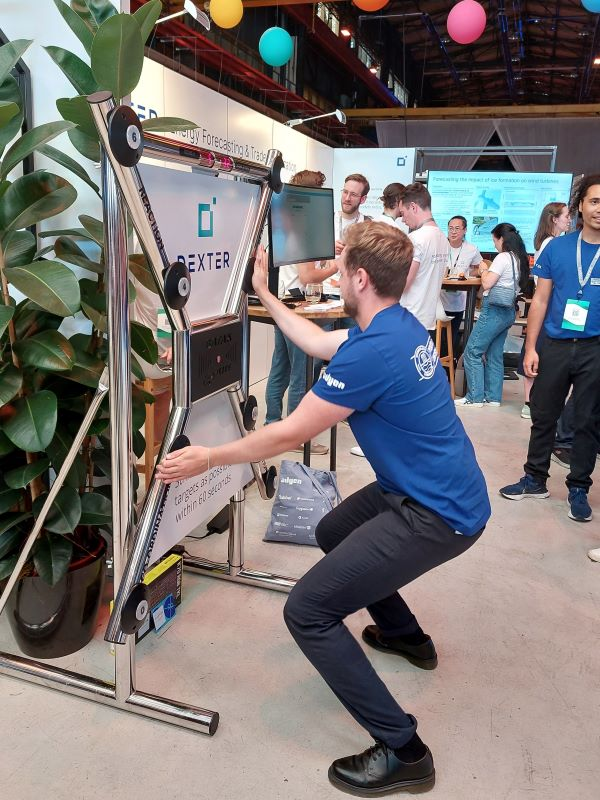
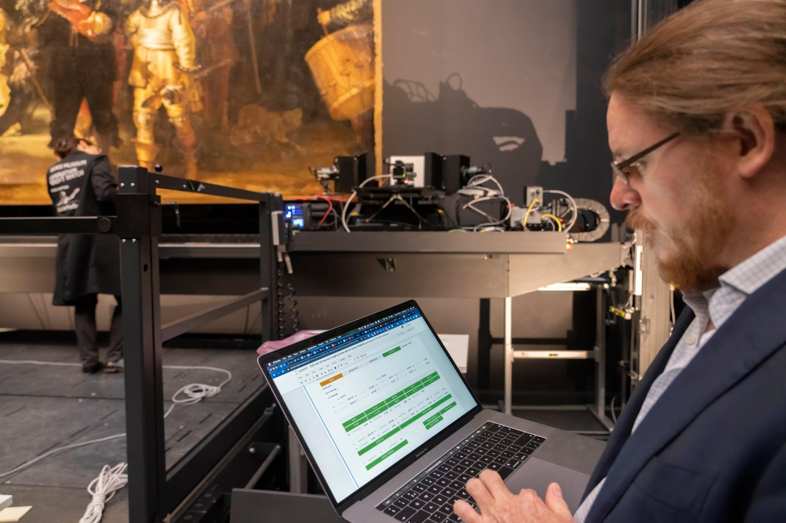

# PyData Amsterdam 2023

Op donderdag 14 September begon PyData Amsterdam; 3 dagen boordevol met informatie over data en Python. De AFM afvaardiging bestond uit Jeroen (KM), Kushalie (KM), Laurens (KM), Leon (KM), Lukas (Retail), Merel (KM), Rijk (KM), en Tim (MIH). De locatie was de Kromhouthal aan het IJ, die voor de gelegenheid feestelijk was ingericht:

Uiteraard waren er ook de nodig sponsor booths, waar je terecht kon voor een nieuwe baan (grapje), entertainment, stickers of andere swag. Op de foto zie je hoe Tim zijn best doe om een bluetooth RGB-keyboard te bemachtigen. Helaas... niet gelukt.

## Goede AI

De dagen begonnen en eindigden met een keynote. Hierin werden we gewezen op het belang van context voor het begrijpen van de ontwikkelingen in AI. Ook privacy en ethische AI stonden vollop in de belangstelling. We werden uitgedaagd om na te denken over een wereld waarin AI een goede, ethische rol speelt. En we werden opgeroepen hiermee zelf aan de slag te gaan.

Gelukkig kwamen ook de tools hiervoor aan bod. Zo was er een praatje over [homomorphic encryption](https://en.wikipedia.org/wiki/Homomorphic_encryption) en over [federated learning](https://en.wikipedia.org/wiki/Federated_learning). Er was zelfs een korte demo met behulp van het package [flwr](https://flower.dev/docs/framework/how-to-install-flower.html).

Ook was er aandacht voor beveiliging, waarbij de risico's van `pickle` in kaart werden gebracht. Het blijkt vrij eenvoudig om een `pickle` te maken met code die je eigenlijk niet wilt draaien... Het package [skops](https://github.com/skops-dev/skops) biedt een veiliger alternatief voor het opslaan van `scikit-learn` modellen.

## Nachtwacht in een Notebook

Over indrukwekkende tooling gesproken; het minitieus fotograferen van de Nachtwacht was een project van formaat. Dit metersgrote schilderij is tot op de micrometer vastgelegd op de gevoelige plaat, waarbij ook Python en Jupyter Notebook een centrale rol speelden... Wie zei ook alweer dat Notebooks niet naar productie kunnen?

## LLM Hype!

Natuurlijk was er veel aandacht voor de laatste hype: Large Language Models (LLMs). Het trainen van zulke enorme modellen vergt heel veel tekst. Eigenlijk is er niet genoeg nette, goed gelabelde tekst beschikbaar en daarom probeert met ook tekst van het internet te gebruiken. Maar - en dat is eigenlijk geen verrassing - de meeste tekst op internet blijkt rommel te zijn... Slechts ~20% bleef over na ontdubbelen en opschonen.

Het trainen van grote modellen kost veel tijd en rekenkracht. Daarom is er steeds meer aandacht voor het efficienter trainen van zulke modellen. Het package [accelarate](https://pypi.org/project/accelerate/) maakt het makkelijk om het trainen op te schalen. Met Parameter Efficient Fine Tuning ([PEFT](https://huggingface.co/docs/peft/index)) kun je eenvoudig klant-en-klare modellen fine tunen voor jouw use case.

Met [skorch](https://skorch.readthedocs.io/en/stable/) kun je op een eenvoudige wijze HugginFace modellen integreren met `scikit-learn`. Dit maakt het eenvoudiger om LLMs toe te passen, bijvoorbeeld voor het labellen van nieuwe data! Dit labellen van data met een LLM wordt [zero-shot classificatie](https://skorch.readthedocs.io/en/latest/user/LLM.html#getting-started-with-zero-shot-classification) genoemd.

## DataFrames in vele smaken

Binnen de AFM zijn we natuurlijk bekend met de `DataFrames` van pandas en `pyspark`. Maar er zijn veel meer smaken op de markt. Zo biedt [polars](https://www.pola.rs/) een vergelijkbaar API met pandas, maar werkt het vele malen sneller.

Ook [dask](https://www.dask.org/) was aanwezig, zelfs met een booth. Dask is biedt gedistribueerde DataFrames zoals Spark, maar dan met een API dat veel meer op pandas lijkt. Vooral indrukwekkend is het overzicht hoe taken verdeeld worden over verschillende machines:

Tot slot was er [duckdb](https://duckdb.org/); dit is een in-memory database waar je met SQL tegenaan kunt praten. Het kan vele verschillende bestandsformaten inlezen (waaronder Excel!) en is super efficient. Daarbij kan het ook goed omgaan met bestanden die te groot zijn om in het geheugen passen.

## Human intelligence is all you need!

Na al het geweld over fantastische nieuwe tools en modellen, was er op de laatste dag ook nog een momentje van "bezinning": laten we vooral niet het belang van menselijke intelligentie vergeten! De verleiding is groot om overal simpelweg `fit()` en `predict()` aan te roepen. Maar wie teveel gefocused is op een bepaalde hypothese of techniek, vergeet wellicht te checken welke patronen er echt in de data zitten:

